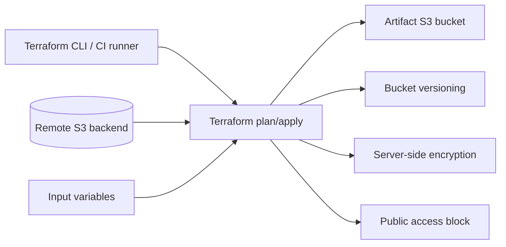

# tf-codepipeline

A Terraform-based AWS infrastructure sandbox focused on secure S3 artifact storage and remote state fundamentals.

This repository is intentionally compact, but it is structured to reflect real infrastructure concerns: parameterization, tagging, state management, encryption, versioning, and public access controls.

## What It Currently Does

The current configuration includes:

- AWS provider setup
- S3 backend configuration for Terraform state
- an S3 artifact bucket
- bucket versioning
- server-side encryption
- public access blocking

## Files

- `versions.tf` — Terraform and provider constraints plus backend configuration
- `variables.tf` — configurable inputs
- `main.tf` — core AWS resource definitions
- `outputs.tf` — exported resource values
- `terraform.tfvars.example` — example input values
- `sample.txt` — placeholder file from the original sandbox
- `docs/architecture.md` — architecture framing and next-step notes

## Tech Stack

- Terraform
- AWS
- S3 remote state backend

## What This Repo Demonstrates

- Terraform workflow discipline
- parameter-driven AWS resource provisioning
- secure-by-default S3 configuration
- remote state usage
- reusable infrastructure patterns suitable for CI/CD building blocks

## Architecture Diagram



## Usage

Initialize Terraform:

```bash
terraform init
```

Copy the example variables file and update the bucket name:

```bash
cp terraform.tfvars.example terraform.tfvars
```

Preview changes:

```bash
terraform plan
```

Apply changes:

```bash
terraform apply
```

## Important Notes

The backend block still contains repo-specific state configuration. Before using it in a real AWS account, you should:

- replace bucket names with your own
- confirm the remote state bucket already exists
- avoid committing environment-specific values
- review backend bucket and state key naming
- confirm IAM permissions for Terraform execution

## Why This Repo Exists

This repo is positioned as an AWS infrastructure practice project for:

- artifact bucket provisioning for delivery pipelines
- remote state configuration
- infrastructure security defaults
- reusable Terraform patterns for DevOps and Cloud Engineering work

## Suggested Next Improvements

- add IAM roles and policies for pipeline access
- extend into CodeBuild / CodePipeline resources
- replace SSE-S3 with KMS-backed encryption where appropriate
- add validation, linting, and automated plan checks in CI
