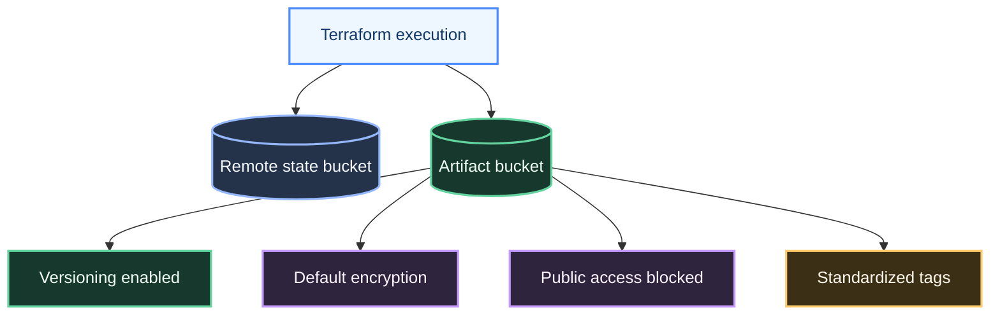

# Architecture Notes

This repository models a small piece of infrastructure commonly needed in CI/CD environments: a hardened S3 bucket that can act as a shared artifact store for deployment pipelines.

## Scope

The current Terraform code provisions:

- an S3 bucket for artifacts
- versioning for change protection
- server-side encryption with SSE-S3
- public access blocking

## Why This Matters

Even a minimal AWS delivery pipeline benefits from a predictable artifact store. This repository is intentionally small, but it demonstrates several patterns expected in real Terraform work:

- parameterized infrastructure
- tag standardization
- security defaults
- state management through a remote S3 backend

## Typical Next Step

The next logical expansion would be to add:

- IAM roles and policies for pipeline access
- CodePipeline / CodeBuild resources
- KMS-backed encryption
- notification hooks or observability integration
